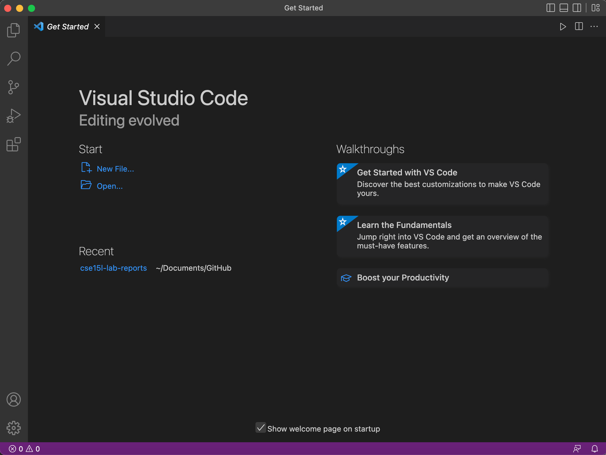
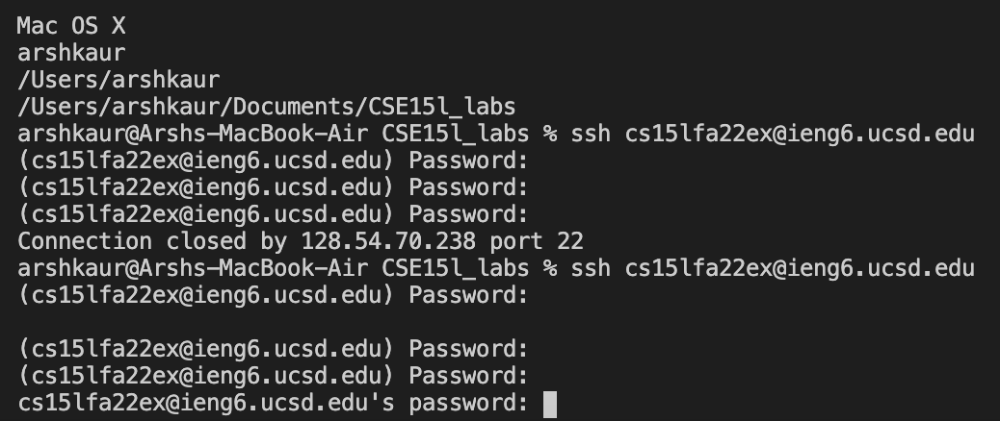

_Week 1 – Remote Access and the Filesystem_
---

This week for lab we learned how to prep our personal computers for remote access to the CSE lab computers.

After obtaining our course specific password from [here](https://sdacs.ucsd.edu/~icc/index.php), and installing VS code to access a terminal, we're ready to go.

First we opened up terminal on VSCode and then typed in

__"ssh cs15lfa22XX@ieng6.ucsd.edu"__

Note: the XX was replaced by our course specific username.

Below you can see my various attempts of waiting and seeing if my password had successfully reset 

