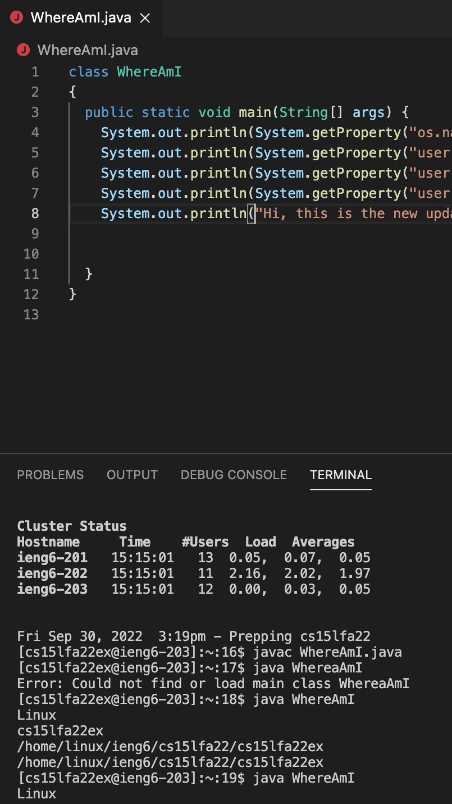

_Week 1 – Remote Access and the Filesystem_

This week for lab we learned how to prep our personal computers for remote access to the CSE lab computers.

**INSTALLING VS CODE**

After obtaining our course specific password from [here](https://sdacs.ucsd.edu/~icc/index.php), and installing VS code from [here](https://code.visualstudio.com/) to access a terminal, we're ready to go.

**REMOTELY CONNECTING**

To remotely connect we had to first  open up terminal on VSCode. On MAC OS, you want open a new file and go to > terminal (in the upper left hand menu) > new terminal. A "terminal" spot should pop up in your IDE, you should be able to type in

__"ssh cs15lfa22XX@ieng6.ucsd.edu"__

Note: the XX was replaced by our course specific username.

From there, enter your password in, and _voila_ we're remotely connected to another computer !

**TRYING SOME COMMANDS**

In lab when my password wouldn't reset, I spent the meantime playing around with some commands on my local computer. 

Here's what _ls -lat_ gave me on my computer

It seems to me that it listed information about all the files and program files I had downloaded on my computer

And here's me trying a couple more commands on the remote computer once I had gotten logged in.

Here's a breakdown of what I tried and what they mean:
"cd~" to go home, whatever directory you're in, this will always return you to your home directory.

"cd" means to change directories, this can be followed by the name of the folder or directory you want to change to. The picture doesn't demonstrate this all that well.

"ls -lat" will files in the current directory you are in by sort by date.

**MOVING FILES WITH SCP**

Let's create a simple java file to let us know our OS name, user name, user home, and user directory, we ran it on both our local computer and the remote computer.

On our computer, create a file named "WhereAmI.java", the code to produce the results we want is listed below.

`class WhereAmI {
  public static void main(String[] args) {
    System.out.println(System.getProperty("os.name"));
    System.out.println(System.getProperty("user.name"));
    System.out.println(System.getProperty("user.home"));
    System.out.println(System.getProperty("user.dir"));
  }
}`

You can see below the switch between the two operating system and users settings.

**SETTING AN SSH KEY**

Setting up an ssh key essentially just let us choose a keyword to log in remotely rather than type our whole password in everytime.

I thought this was super cool because it was getting tiresome going back and forth between log on and off the remote computer.

Here's a closer look at what you can expect after setting up a passphrase to let you quicker.

Also note, it is case sensitive !

**OPTIMIZING REMOTE RUNNING**

As for trying to copy my file over in less than 10 keystrokes, I was unsucessful, I'm curious to see how people get this done in less than 10 keystrokes.

However I ended up waiting at least 10 minutes to give it time to copy files over, and when I went to run it again on my remote computer, it still displayed the old files' output. I fear I may be doing something wrong on that account

