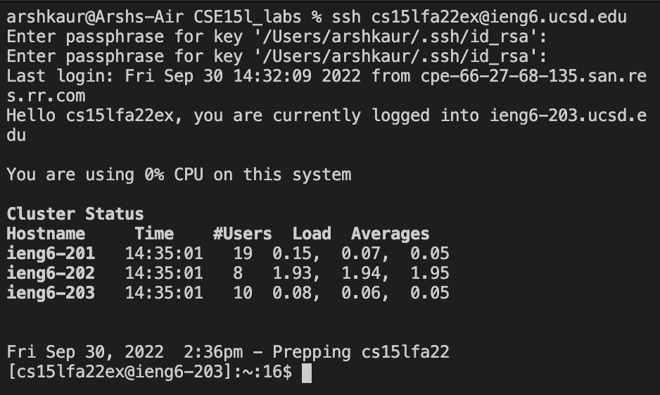
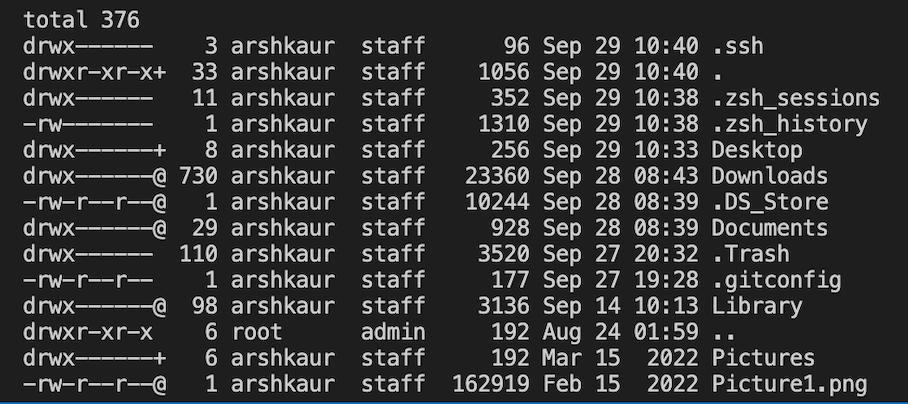
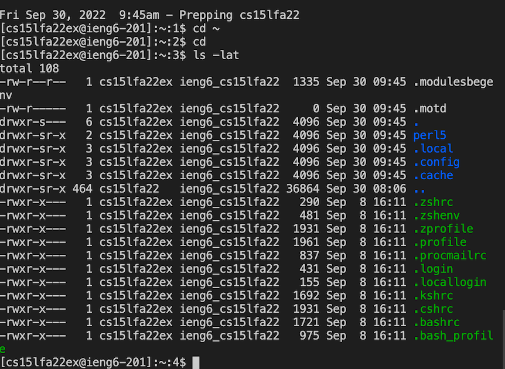
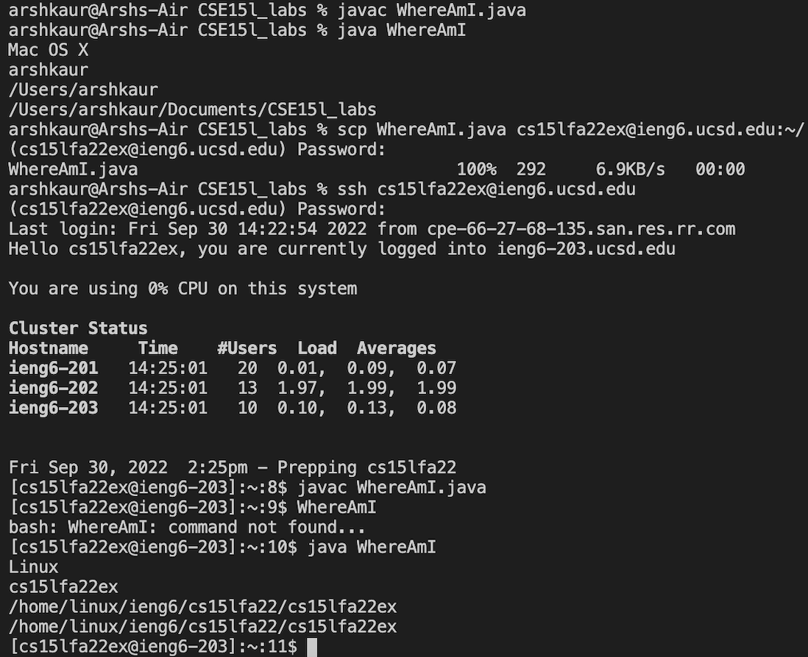
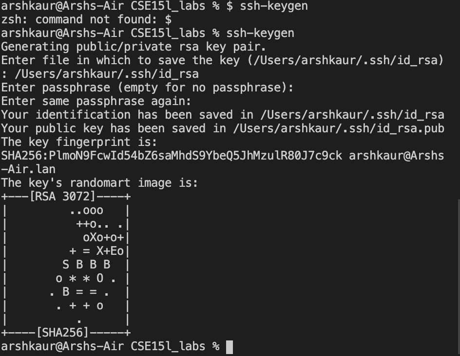

_Week 1 – Remote Access and the Filesystem_
---

This week for lab we learned how to prep our personal computers for remote access to the CSE lab computers.

<h4>INSTALLING VS CODE<h4>

After obtaining our course specific password from [here](https://sdacs.ucsd.edu/~icc/index.php), and installing VS code to access a terminal, we're ready to go.

<h4>REMOTELY CONNECTING<h4>

To remotely connect we had to first  open up terminal on VSCode and then type in

__"ssh cs15lfa22XX@ieng6.ucsd.edu"__

Note: the XX was replaced by our course specific username.

From there enter your password in and _voila_ we're remotely connected to another computer !

<h4>TRYINGSOMECOMMANDS<h4>
In lab when my password wouldn't reset, I spent the meantime playing around with some commands on my local computer. 

Here's what _ls -lat_ gave me on my computer

It seems to me that it listed information about all the files and program files I had downloaded on my computer

And here's me trying a couple more commands on the remote computer once U had gotten logged in

<h4>MOVING FILES WITH SCP<h4>
After creating a simple java file to let us know our OS name, user name, user home, and user directory, we ran it on both our local computer and the remote computer.

You can see below the switch between the two operating system and users settings.

<h4>SETTING AN SSH KEY<h4>
Setting up an ssh key essentially just let us choose a keyword to log in remotely rather than type our whole password in everytime.

I thought this was super cool because it was getting tiresome going back and forth between log on and off the remote computer.

Here's a closer look at what you can expect after setting up a passphrase to let you quicker.

<h4>OPTIMIZING REMOTE RUNNING<h4>