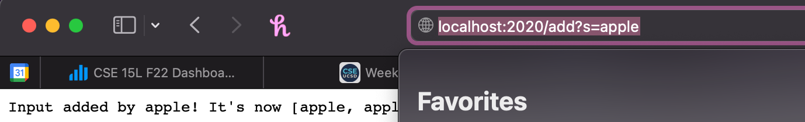
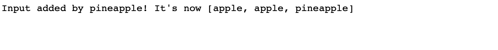
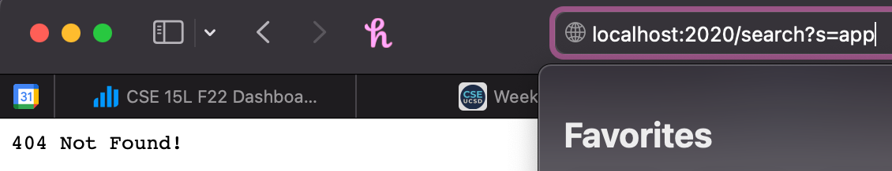

_Week 3_

Over the past 2 weeks we've learned how to create web servers and finding symptoms and solving bugs

**PART 1**
This is the code I ended up having for the Simple Search Engine, sadly it was able to add fine, but ran into issues when it came down to searching for the element.

Here's the code snippet for add
```
ArrayList<String> arrayList = new ArrayList<>(); 

    public String handleRequest(URI url) {
        if (url.getPath().equals("/")) {
            return String.format("Output: %d", input);
        } else {
            System.out.println("Path: " + url.getPath());

            if (url.getPath().contains("/add"))
            {
                String[] parameters = url.getQuery().split("=");
                if (parameters[0].equals("s"))
                {
                    arrayList.add(parameters[1]);
                    return String.format("Input added by %s! It's now %s", parameters[1], arrayList.toString());
                }
            }
        }
    }
```

Here's the code snippet for the search query
```
if (url.getPath().contains("/search"))
{
    String[] parameter = url.getQuery().split("=");
    
    if (parameter[0].equals("s"))
    {
        if (arrayList.contains(parameter[1]))
        {
            for (String element: arrayList)
            {
                if(element.contains(parameter[1]))
                {
                    return String.format(element);
                }
            }
        }
        arrayList.add(parameter[1]);
    }
```

Here's the add method being used with the call
```
http://localhost:2020/add?s=apple
```


And the string array being expanded on


When we call add, we're implementing the first snippet of code, we're using an arrayList and parsing the code by using `regex` to make all the input after the call into different parameters. Then we're comparing those parameters, adding them if they're valid to the array list, and returning them in a string format. Which can be observed on the server webpage.

Here's the search method being used:


After spending 2 hours writing and testing, I've been unable to get this to work correctly.

Here's a rundown of what's going on. We're implementing the same parsing techique by using `regex`. Then we're checking if the array list we're putting all of our inputs contain the input we put into search, if does, we output and return the element that rings up as the same. However everytime I test this, I receieved a "404 Not Found!"

**PART 2**
This week we looked at bugs and how to look for symptoms and run tests on them.

The first bug I found was in __"ArrayExamples.java"__
Here's the code that was symptom inducing and producing the error
```
static void reverseInPlace(int[] arr) {
    for(int i = 0; i < arr.length; i += 1) {
      arr[i] = arr[arr.length - i - 1];
    }
  }
```
Basically what this was doing is copying the 2nd part of the array onto the 1st part, for example [1,2,3,4,5] turned into ----> [5,4,3,4,5]. Which reversed the first half but left the 2nd half out.

Here's the JUnit failure it provided


Here's the fixed code that allowed it to pass the JUnit test
```
for(int i = 0; i < arr.length/2; i += 1)
    {
      int temp = arr[i];
      arr[i] = arr[arr.length - i - 1];
      arr[arr.length - 1 - i] = temp; 

    }
```
When we were doing our JUnit test, we were recieving a different input from what we were expecting, that was a symptom for the fact something was wrong and buggy with our code. 


