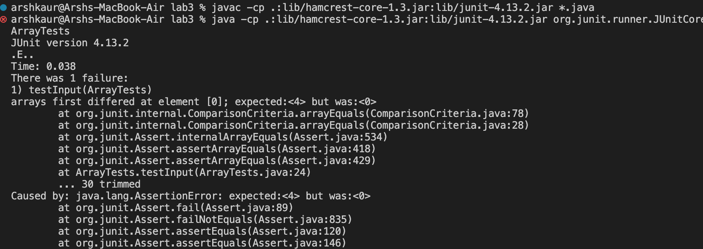

_Week 3_

Over the past 2 weeks we've learned how to create web servers and finding symptoms and solving bugs

<h3>PART 1</h3>
This is the code I ended up having for the Simple Search Engine, sadly it was able to add fine, but ran into issues when it came down to searching for the element.

Here's the code snippet for our Simple Search Engine 
```
import java.io.IOException;
import java.net.URI;
import java.util.ArrayList;

class Handler implements URLHandler
{
    ArrayList<String> arrayList = new ArrayList<>();

    public String handleRequest(URI url)
    {
        if (url.getPath().equals("/"))
        {
            String output = ""; 

            for (int i = 0; i < arrayList.size(); i++)
            {
                output += arrayList.get(i); 
            }

            return "List: " + output; 
        }

        else if (url.getPath().contains("/add"))
        {
            String[] parameters = url.getQuery().split("=");

            if (parameters[0].equals("s"))
            {
                arrayList.add(parameters[1]);
                return String.format("Input added by %s! It's now %s", parameters[1], arrayList.toString());
            }
            return "404 Not Found!"; 
        }

        else if (url.getPath().contains("/search"))
        {
            String[] parameters = url.getQuery().split("=");
            String empty = "";

            if (parameters[0].equals("s"))
            {
                for(int i = 0; i < arrayList.size(); i++)
                {
                    if(arrayList.get(i).contains(parameters[1]))
                    {
                        empty += arrayList.get(i) + " "; 
                    }

                    if(empty.equals(" "))
                    {
                        return "No strings found."; 
                    }
                }
                return empty; 
            }
        }
        return "404 Not Found!";
    }
}
    
class SearchEngine
{
    public static void main(String[] args) throws IOException {
        if(args.length == 0){
            System.out.println("Missing port number! Try any number between 1024 to 49151");
            return;
        }

        int port = Integer.parseInt(args[0]);

        Server.start(port, new Handler());
    }
}

```

Here's the add method being used with the call
```
http://localhost:4030/add?s=apple
```


When we call add, we're implementing the first snippet of code, we're using an Array List and parsing the code by using `regex` to make all the input after the call into different parameters. This is using the first else if statement in our code, the method is trigger because we are using the keyword "/add". By using an Array List we're able to store all of our parameters and access them easily for the serach method. Then we're comparing those parameters, adding them if they're valid to the array list, and returning them in a string format. Which can be observed on the server webpage

Here's the search method being used:


As you can see we're searching the array list that was displaying when using the /add method. The output provides us with any words that contain "app" in it. When using this method, we enter the third if statement in our code. We're implementing the same parsing techique by using `regex`. Then we're checking if the array list we're putting all of our inputs in actually contain the input that we're searching for if does, we output and return the elements that contain the keyword. If we search for something that is not in our array of inputs, we'll display a `No strings found` message. 


<h3>PART 2</h3>
This week we looked at bugs and how to look for symptoms and run tests on them.

**Bug #1: reverseInPlace()**
The first bug I found was in __"ArrayExamples.java"__. The method that was producing the error was `reverseInPlace()`.

**Testing**\
We tested this method with the JUnit test below
```
@Test
    public void testReverseInPlace()
    {
        int[] a1 = {1,2,3,4}
        int[] a2 = {4,3,2,1};
        assertArrayEquals(a2, ArrayExamples.reverseInPlace(a1));
    }
```

**Symptom**\
The Junit test revealed that we expected <2>, but we received <3> at element [2] in our array. 

**Bug**\
Here's the code that was symptom inducing and producing the error
```
static void reverseInPlace(int[] arr) {
    for(int i = 0; i < arr.length; i += 1) {
      arr[i] = arr[arr.length - i - 1];
    }
  }
```
Basically what this was doing is copying the 2nd part of the array onto the 1st part, for example [1,2,3,4,5] turned into ----> [5,4,3,4,5]. Which reversed the first half but left the 2nd half out.

Here's the JUnit failure it provided


Here's the fixed code that allowed it to pass the JUnit test
```
for(int i = 0; i < arr.length/2; i += 1)
    {
      int temp = arr[i];
      arr[i] = arr[arr.length - i - 1];
      arr[arr.length - 1 - i] = temp; 

    }
```
**Connection**\
When we were doing our JUnit test, we were recieving a different input from what we were expecting, that was a symptom for the fact something was wrong and buggy with our code. 

**Bug #2: filter()**\
The second bug we will be looking at is in __ListExamples.java__. The method that was buggy is `filter()`.

This method returns a list in the order in which they were added with all of the inputs that StringChecker reurns true. So all of the inputs that return false will not be in the newly created list.

**Testing**\
To test this method we had to create a class that implements StringChecker. This class returns true if the string's length is greater than 2.

Then using this class we were able to write a JUnit test 
```
@Test
    public void testFilter()
    {
        List<String> testIn = Arrays.asList("a", "b", "two", "three", "c");
        List<String> testEx = Arrays.asList("two", "three");
        assertArrayEquals(testEx.toArray(), ListExamples.filter(testIn, new lengthCheck()).toArray()))
    }
```
**Symptom**\
We expected "two" to be at the 0th index, however the test failed with "three" at 0th index. The order the inputs are being inserted into the list is incorrect. So let's go and investigate that

**Bug**\
We were able to find the bug in the code below:
```
static List<String> filter(List<String> list, StringChecker sc) {
    List<String> result = new ArrayList<>();
    for(String s: list) {
      if(sc.checkString(s)) {
        result.add(0, s);
      }
    }
    return result;
}
```
Examining this code, we can see that instead adding the new input to the back of the list regularly, the input is being added to the front of the list like a stack.

So to fix it we altered the code to this below:
```
static List<String> filter(List<String> list, StringChecker sc) {
    List<String> result = new ArrayList<>();
    for(String s: list) {
      if(sc.checkString(s)) {
        result.add(s);
      }
    }
    return result;
}
```
**Connection**\
The bug caused our original mixup because add was being used incorrectly in this case. The way it was written was saying add(index, element), and since the index was set to 0, every time a new element was added, it would be pushed to the front of the list. 


