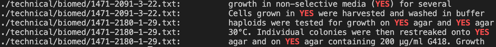
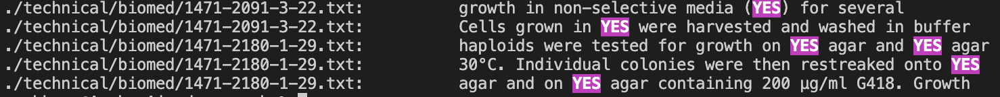
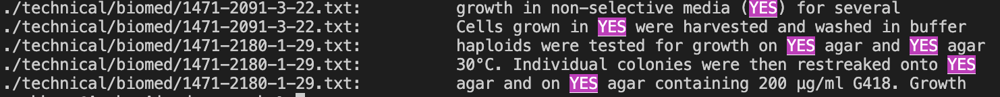

<h1>_Week 5: Researching Commands_</h1>

We've been doing a lot of work with the terminal and terminal commands. Below I will showing some different and perhaps new to you ways on how to use some of these commands and some alternate ways to use them. 

<h3>The "Grep" command</h3>
We will be exploring different ways to use the grep command and its alternates.

__Different uses of the ```$``` sign:__

If we use the ```$``` after a keyword, it shows all the lines in the file or directory we're searching in that end in that word.


Example 1:

```arshkaur@Arshs-Air docsearch % grep -r today$ ./technical```

This command will give us any lines in ./technical that end in "today".

Here's the output below:
```

/technical/government/About_LSC/Progress_report.txt:increase in the number of people who enter the justice system today
./technical/government/Gen_Account_Office/d03419sp.txt:However, there is a lot of dialogue taking place today
./technical/government/Gen_Account_Office/Oct15-1999_gg00026t.txt:management improvement initiatives that we have discussed today
./technical/government/Gen_Account_Office/d01591sp.txt:and stronger economic growth over the long term. Saving today
./technical/government/Gen_Account_Office/d01591sp.txt:return depends not only on their preferences about spending today
./technical/government/Gen_Account_Office/d01591sp.txt:increasing saving are intertwined national goals. Saving more today
./technical/government/Media/Workers_aid_center.txt:Workers' aid center open today
./technical/biomed/1476-069X-2-4.txt:        benefits, retrofitting one million existing homes today
./technical/biomed/1476-069X-2-4.txt:        new homes per year), this implies that a code change today
./technical/biomed/1472-6947-2-7.txt:          Information technology in healthcare today
./technical/biomed/1472-6750-2-2.txt:        extended to many crops far beyond what is possible today

```
This is useful for if you want to filter a bunch of files. Or find important dates or files fast.


We can also look for empty files with `$`

Example 2: 

```arshkaur@Arshs-Air docsearch % grep -r ^$ ./technical```

The output is too long to display but here's a snippet of some of the empty lines within files it returns: 

```
./technical/911report/chapter-1.txt:
./technical/911report/chapter-1.txt:
./technical/911report/chapter-1.txt:
./technical/911report/chapter-1.txt:
./technical/911report/chapter-1.txt:
./technical/911report/chapter-1.txt:
./technical/911report/chapter-5.txt:
./technical/911report/chapter-6.txt:
./technical/911report/chapter-7.txt:
./technical/911report/chapter-9.txt:
./technical/911report/chapter-8.txt:
./technical/911report/preface.txt:
./technical/911report/chapter-12.txt:
./technical/911report/chapter-10.txt:
./technical/911report/chapter-11.txt:
```

This is helpful if you want to find all your blank lines within files. Whether to delete them or to use them, it can help cut down on useless empty lines within files. 


And of course the question comes up, what if you want to actually search for the dollar sign itself within these files ?

Example 3:

```arshkaur@Arshs-Air docsearch % grep -r '\$' ./technical```

This will output all the lines within the files containing "$" itself. The output again is too big, but here's snippet below

```
./technical/911report/chapter-7.txt:                hijackers are known to have purchased a total of nearly $50,000 in traveler's checks
./technical/911report/chapter-7.txt:                $30,000 on June 25, 2001. After his June 27 arrival in the United States, Banihammad
./technical/911report/chapter-7.txt:                UAE totaling $15,000 and, within days, relayed almost all of this money to Moussaoui
./technical/911report/chapter-7.txt:                July 10, he put down a $1,500 deposit for flight simulator training at Pan Am
./technical/911report/chapter-7.txt:                $6,800 balance owed for his flight simulator training at Pan Am in cash and began
./technical/911report/chapter-7.txt:                Hawsawi in the UAE, about $26,000 altogether.
./technical/911report/chapter-9.txt:                Authority spent an initial $100 million to make physical, structural, and
./technical/911report/chapter-8.txt:                Moreover, Moussaoui had $32,000 in a bank account but did not provide a plausible
./technical/911report/chapter-12.txt:                more than 50 percent, from $354 billion to about $547 billion. The United States has
./technical/911report/chapter-12.txt:                capita income has dropped from $28,000 at its height to the present level of about
./technical/911report/chapter-12.txt:                $8,000. Social and religious traditions complicate adjustment to modern economic
./technical/911report/chapter-12.txt:                the U.S. transportation sector. Over 90 percent of the nation's $5.3 billion annual
./technical/911report/chapter-10.txt:                    provide $20 billion for New York City, in addition to the $20 billion his budget
```
As you can see this returns every lines within the directory with $ itself. This is helpful if you have certain numbers for a budget or statistic embedded within your files that you want to pull up quickly.

__Different uses of the color option sign:__

Searching through files, lines, strings is very hard on user readability. The color option in grep can help with that.


Example 1:

```arshkaur@Arshs-Air docsearch % grep -r --color=auto YES ./technical```

The above command gives us this output (showing a screenshot instead of text block to illustrate the color):


This allows for the user to clearly see the keyword they're looking for in contrast to all the other text. This is especially helpful if you know exactly what you're looking for, but you have several files to look through.


But the fun doesn't stop there, you can also highlight, and change colors while searching for keywords.

Example 2:
The first line is exporting the enviroment variable, you can see a full menu of options _[here](https://arkit.co.in/practical-grep-command-tricks/)_ 

The first number in the quotations is the attribute, in this case, it's "bright", the second number is the foreground color, the third number is the background color.

Here's the commands in action:

```
arshkaur@Arshs-Air docsearch % export GREP_COLOR='1;35;45'         
arshkaur@Arshs-Air docsearch % grep -r --color=auto YES ./technical
```

The output is illutrated below:


This is just helpful for customization. In addition to the highlight standing out more than just the text color changing.


Example 3:

You can also underline the keyword, using 4 from the menu for the first number:

```
arshkaur@Arshs-Air docsearch % export GREP_COLOR='4;35;45'       
arshkaur@Arshs-Air docsearch % grep -r --color=auto YES ./technical
```

And here's the output below:



