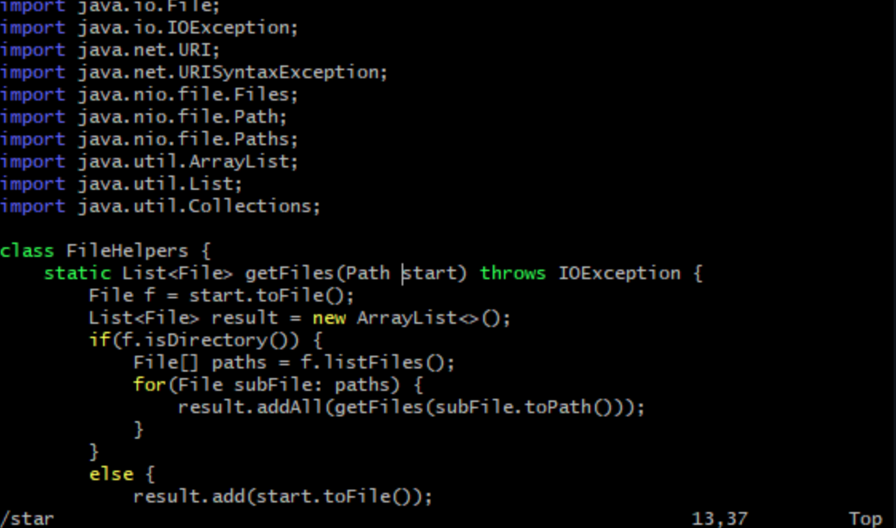
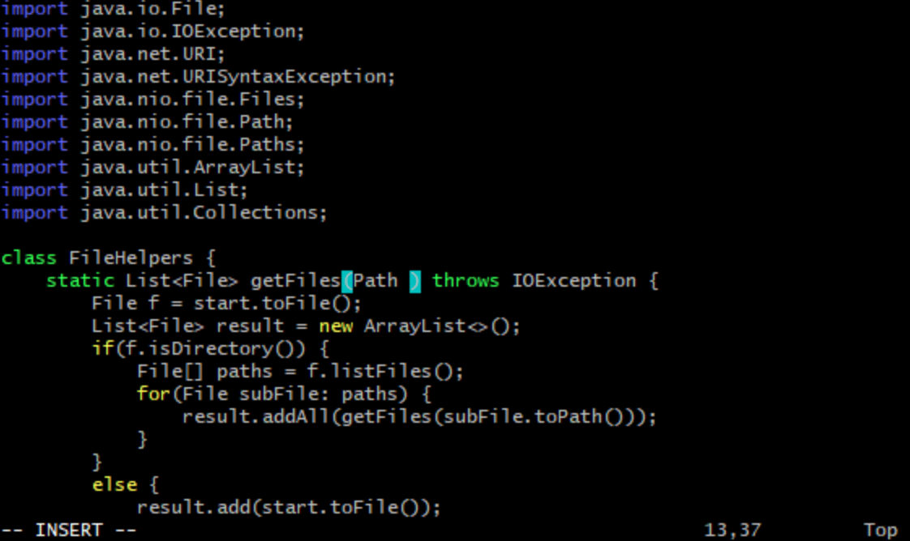
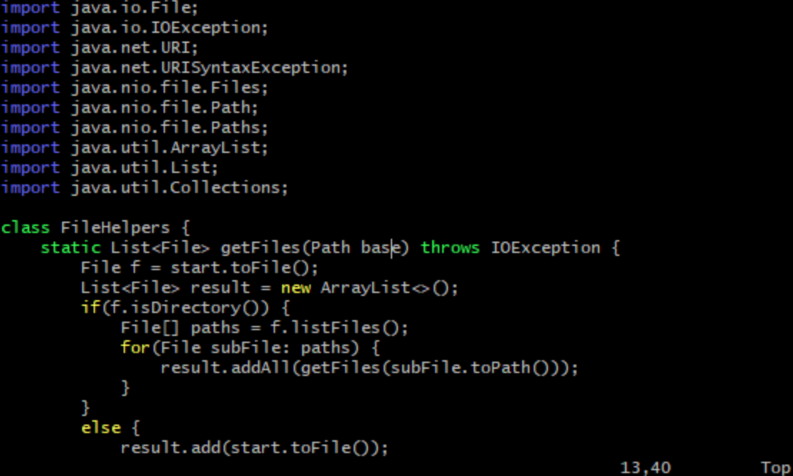
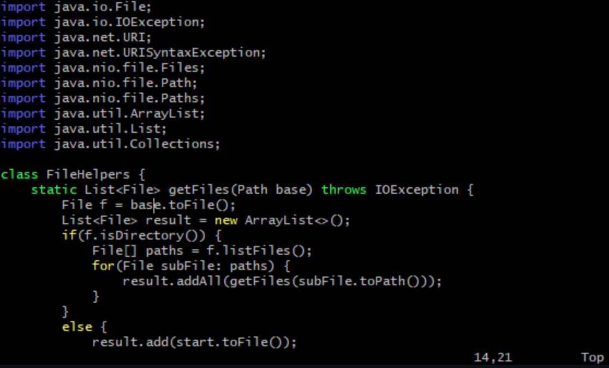
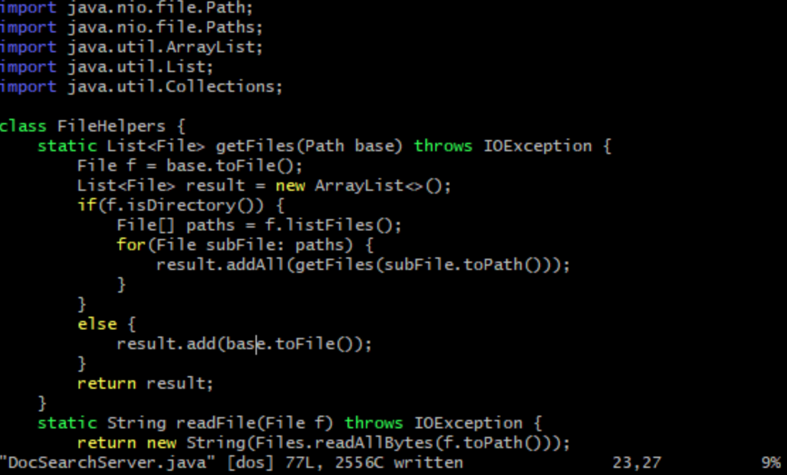

<h1>Week 7: Vim</h1>

<h3>Part One</h3>

We choose to change the name of the `start` parameter to `base`.
The steps to do this in 30 steps or less in vim is listed down below: 

First to enter the document in vim, we;re going to type `vim DocSearchServer.java`. Then we use the `/star` command, the `/` command is the search and typing in `star` is enough to highlight all the starts. This also sets the cursor on the at the beginning of the first word. Then we press `<enter>`to return us to normal mode.

Next we're going to go into change mode by typing `c`. Then we use `e` to delete the whole word that the cursor is on, so this deletes start. 

Now we're in insert mode, and since start is gone we type `base` to replace `start` that we deleted. Then press `<esc>` to get back to normal mode. 

Using the `n` keyword we jump to the next search result for `start`. Once again the cursor moves to the beginning of the word. Then we repeat the past changes we made by using the `.` keystroke which comes in handy. And then we type `n.` again to replace the third start.

Our last `:w` saves the changes to the file. 

In total this was 22 keystokes so we hit our goal of being under 30 !

<h3>_Part Two</h3>

So I loaded this up in visual studios to make the same edits, and it may have been I am not as used to VS code, but it took me 61s to edit and make the necessary changes, meanwhile it takes me 27s to use vim to edit the same file. I think one of the clear differences here is the necessary use of a mouse in VS code. You could just use just your arrows and keypad for VS code, but I would asumme that would take longer because we don't have the same shortcuts we do in vim. Whereas in vim, it takes just 22 keystrokes. I will say though, it may be faster in vim because this has been rehearsed a couple of times.

1. I think I would prefer vim, the commands don't seem to hard to pick up on, and it would nice to not have to pick up my fingers from the keyboard.

2. I think I would use vim for simple or small edits that I have to make quickly to a file. I feel like moving into between files and etc. may be easier on visual studio code.

